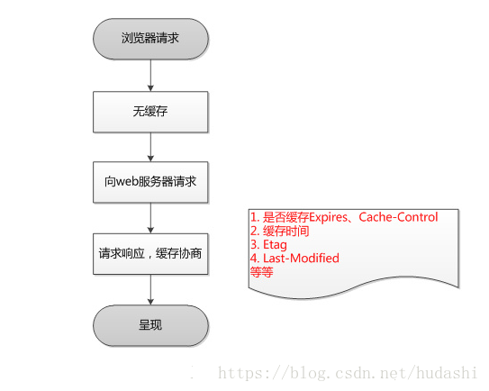
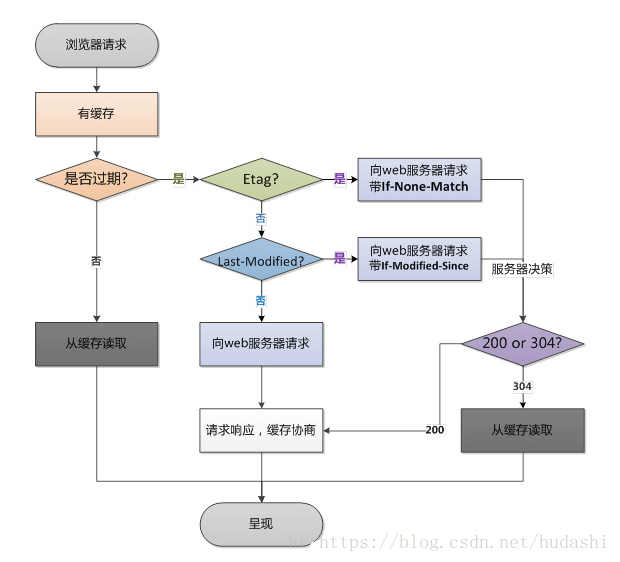
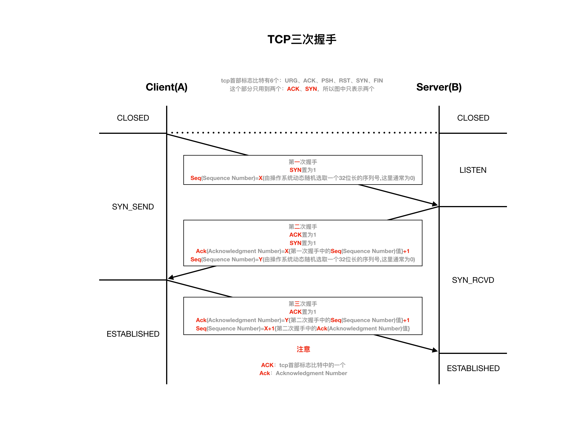
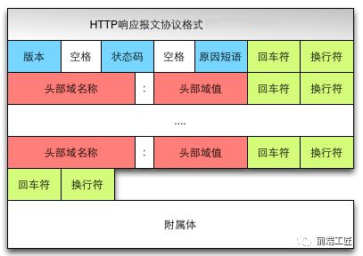
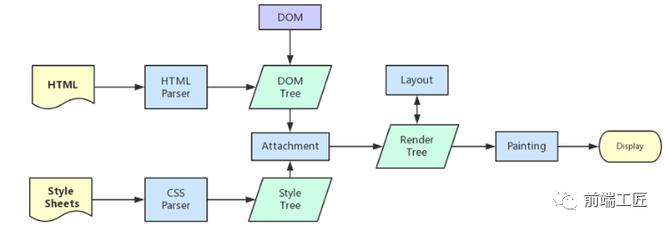
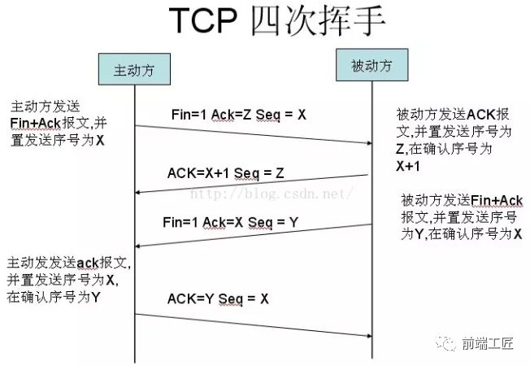

## URL到页面到底经历了什么

### 1. 游览器查看缓存





### 2. 浏览器解析URL获取协议，主机，端口，path

 * URL是啥？

	```
	scheme://host.domain:port/path/filename?
	```
	- scheme: 协议，常见的有 http、https、ftp、file
	- domain：域名，通过域名操作服务器IP
	- port: 端口号
	- path： 路径
	- filename: 定义文档/资源的名称
	- ?：后接查询参数等


### 3. DNS解析

* 即域名解析，因为浏览器并不能直接通过域名找到对应的服务器，而是要通过 IP 地址。从域名找到IP的过程就是DNS解析

1. 当游览器输入www.baidu.com 时

2. 游览器首发搜索的自身的DNS缓存

	- 游览器会将DNS解析的IP与域名缓存起来，减少网络请求的损耗。
	- 每个游览器的缓存时间不一样，chrome为60s、IE为30min、Firefox为60s
	
 	2.1 DNS prefetch (游览器DNS预解析)
 	
 	* 根据浏览器定义的规则，提前解析之后可能会用到的域名，使解析结果缓存到系统缓存中，缩短DNS解析时间，来提高网站的访问速度。
 	* 
 	* 现代浏览器在 DNS Prefetch 上做了两项工作：

		1. html 源码下载完成后，会解析页面的包含链接的标签，提前查询对应的域名
		
		2. 对于访问过的页面，浏览器会记录一份域名列表，当再次打开时，会在 html 下载的同时去解析 DNS
 	
   * 分为两种：
   
   		1） 自动解析：
   		
   		浏览器使用超链接的href属性来查找要预解析的主机名。当遇到a标签，浏览器会自动将href中的域名解析为IP地址，这个解析过程是与用户浏览网页并行处理的。但是为了确保安全性，在HTTPS页面中不会自动解析
  		
  		2） 手动解析：
  		
  		```
  		通过link
  		<link rel="dns-prefetch" href="www.baidu.com">
  		
  		在HTTPS页面开启自动解析功能时
  		<meta http-equiv="x-dns-prefetch-control" content="on">
  		
  		在HTTP页面关闭自动解析功能时
  		<meta http-equiv="x-dns-prefetch-control" content="off">

  		```  			
3. 若游览器没有，则搜索操作系统中的DNS缓存
4. 若没有，则搜索操作系统的hosts文件
5. 路由缓存：路由器也有 DNS 缓存。
6. ISP 的 DNS 服务器：ISP 是互联网服务提供商(Internet Service Provider)的简称，ISP 有专门的 DNS 服务器应对 DNS 查询请求
7. 根服务器：ISP 的 DNS 服务器还找不到的话，它就会向根服务器发出请求，进行递归查询（DNS 服务器先问根域名服务器.com 域名服务器的 IP 地址，然后再问.baidu 域名服务器，依次类推）

### 4. 打开一个socket与目标IP地址，端口建立TCP链接(三次握手)
	
* 在《计算机网络》一书中其中有提到，三次握手的目的是“为了防止已经失效的连接请求报文段突然又传到服务端，因而产生错误”

```
SYN：synchronous建立联机

ACK：acknowledgement 确认

1. 第一次握手：客户端发送一个SYN=1，seq=x（x是随机数字的意思）的数据包，服务器看到我们发过来数据包，就知道你要跟他建立链接

2. 第二次握手：服务器发给我们一个SYN=1，seq=y，ACK=x+1。服务器发送前两个数据是为了确认自己的发消息能力，第三个数据在我们的seq上加1，以确认建立的是同一个链接。
2. 第三次握手：我们只需要向服务器发送一个ACK=y+1，服务器便可以确认自己的发送能力了。

```


### 3. 开始发送 HTTP 请求报文


```
第一部分：请求行（请求资源地址）

POST /examples/default.jsp HTTP/1.1

/*
 * POST（Method 请求方法）
 * /examples/default.jsp（URI：Uniform Resource Identifier 统一资源标识符）
 * HTTP（Protocol 协议）/1.1（Version 版本）
 */


第二部分：请求头（Request headers）

Accept: text/plain; text/html 

请求头包含请求的附加信息，由关键字/值对组成，每行一对，关键字和值用英文冒号“:”分隔


第三部分：第三部分：请求体（Entity body）

lastName=Franks&firstName=Michael

```

### 6. 服务器处理请求并返回 HTTP 报文

#### 6.1 服务器

服务器是网络环境中的高性能计算机，它侦听网络上的其他计算机（客户机）提交的服务请求，并提供相应的服务.

#### 6.2 MVC 后台处理阶段

#### 6.3 http 响应报文



```
第一部分：响应行

HTTP/1.1 200 OK

/*
 * HTTP（Protocol 协议）/1.1（Version 版本）
 * 200（Status code）
 * OK（Description）
 */

第二部分：响应头

Server: Microsoft-IIS/4.0  
Date: Mon, 5 Jan 2004 13:13:33 GMT  
Content-Type: text/html  
Last-Modified: Mon, 5 Jan 2004 13:13:12 GMT  
Content-Length: 112
....

第三部分：响应体

<html>
   <head></head>  
	<body>
		....
   </body>
</html>

```
### 7. 浏览器解析渲染页面



### 7.1 根据 HTML 解析 DOM 树

根据 HTML 的内容，将标签按照结构解析成为 DOM 树，DOM 树解析的过程是一个深度优先遍历。即先构建当前节点的所有子节点，再构建下一个兄弟节点。
在读取 HTML 文档，构建 DOM 树的过程中，若遇到 script 标签，则 DOM 树的构建会暂停，直至脚本执行完毕。
### 7.2 根据 CSS 解析生成 CSS 规则树

解析 CSS 规则树时 js 执行将暂停，直至 CSS 规则树就绪。
浏览器在 CSS 规则树生成之前不会进行渲染。
### 7.3 结合 DOM 树和 CSS 规则树，生成渲染树
* DOM树 和 css 树解析为并行，二者全部完成后才会结合生成渲染树

DOM 树和 CSS 规则树全部准备好了以后，浏览器才会开始构建渲染树。
精简 CSS 并可以加快 CSS 规则树的构建，从而加快页面相应速度。
### 7.4 根据渲染树计算每一个节点的信息（布局）

布局：通过渲染树中渲染对象的信息，计算出每一个渲染对象的位置和尺寸
回流：在布局完成后，发现了某个部分发生了变化影响了布局，那就需要倒回去重新渲染。
### 7.5 根据计算好的信息绘制页面

绘制阶段，系统会遍历呈现树，并调用呈现器的“paint”方法，将呈现器的内容显示在屏幕上。
重绘：某个元素的背景颜色，文字颜色等，不影响元素周围或内部布局的属性，将只会引起浏览器的重绘。
回流：某个元素的尺寸发生了变化，则需重新计算渲染树，重新渲染。


### 8. 断开连接(四次挥手)

* 接收完毕后断开链接



1）客户端进程发出连接释放报文，并且停止发送数据。释放数据报文首部，FIN=1，其序列号为seq=u（等于前面已经传送过来的数据的最后一个字节的序号加1），此时，客户端进入FIN-WAIT-1（终止等待1）状态。 TCP规定，FIN报文段即使不携带数据，也要消耗一个序号。

2）服务器收到连接释放报文，发出确认报文，ACK=1，ack=u+1，并且带上自己的序列号seq=v，此时，服务端就进入了CLOSE-WAIT（关闭等待）状态。TCP服务器通知高层的应用进程，客户端向服务器的方向就释放了，这时候处于半关闭状态，即客户端已经没有数据要发送了，但是服务器若发送数据，客户端依然要接受。这个状态还要持续一段时间，也就是整个CLOSE-WAIT状态持续的时间。

3）客户端收到服务器的确认请求后，此时，客户端就进入FIN-WAIT-2（终止等待2）状态，等待服务器发送连接释放报文（在这之前还需要接受服务器发送的最后的数据）。

4）服务器将最后的数据发送完毕后，就向客户端发送连接释放报文，FIN=1，ack=u+1，由于在半关闭状态，服务器很可能又发送了一些数据，假定此时的序列号为seq=w，此时，服务器就进入了LAST-ACK（最后确认）状态，等待客户端的确认。

5）客户端收到服务器的连接释放报文后，必须发出确认，ACK=1，ack=w+1，而自己的序列号是seq=u+1，此时，客户端就进入了TIME-WAIT（时间等待）状态。注意此时TCP连接还没有释放，必须经过2∗∗MSL（最长报文段寿命）的时间后，当客户端撤销相应的TCB后，才进入CLOSED状态。

6）服务器只要收到了客户端发出的确认，立即进入CLOSED状态。同样，撤销TCB后，就结束了这次的TCP连接。可以看到，服务器结束TCP连接的时间要比客户端早一些。


### 参考

https://mp.weixin.qq.com/s/Ln-0uWdYh1CnRUX2FouDWg

http://blog.poetries.top/FE-Interview-Questions/base/#_8-%E4%BB%8B%E7%BB%8D%E4%B8%80%E4%B8%8B%E4%BD%A0%E5%AF%B9%E6%B5%8F%E8%A7%88%E5%99%A8%E5%86%85%E6%A0%B8%E7%9A%84%E7%90%86%E8%A7%A3%EF%BC%9F